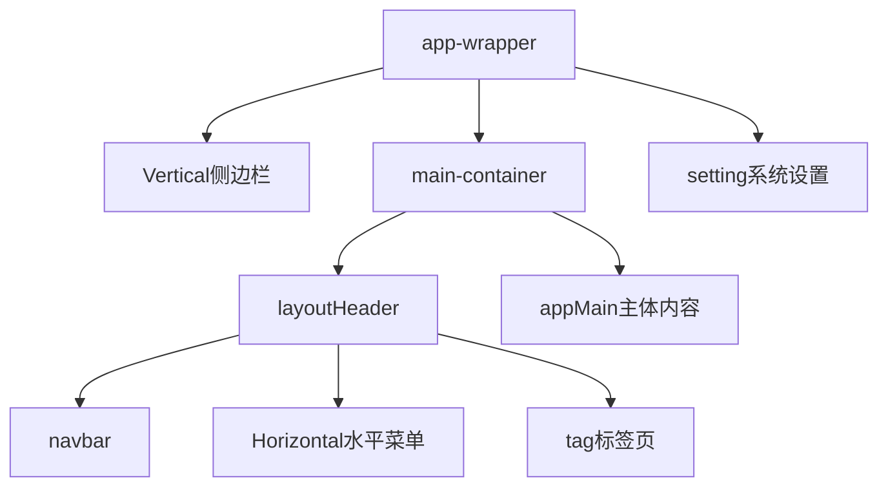

```mermaid
graph TD
    A[app-wrapper] --> B[Vertical侧边栏]
    A --> C[main-container]
    C --> D[layoutHeader]
    D --> E[navbar]
    D --> F[Horizontal水平菜单]
    D --> G[tag标签页]
    C --> H[appMain主体内容]
    A --> I[setting系统设置]

```

